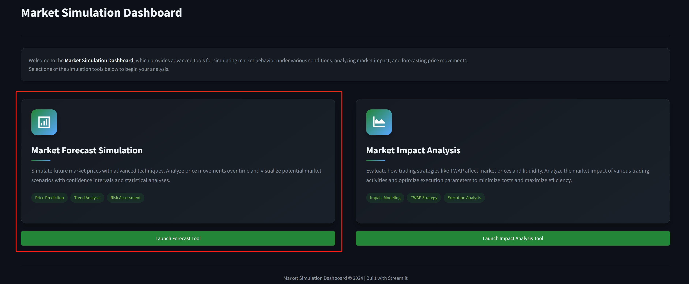
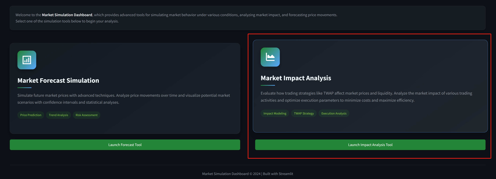
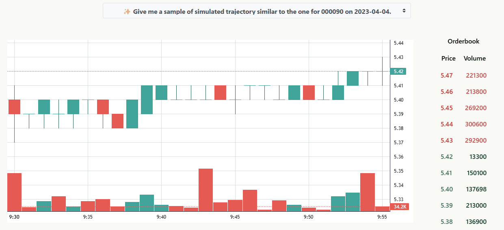
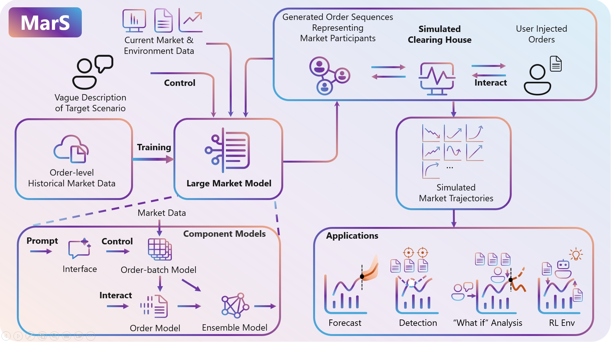
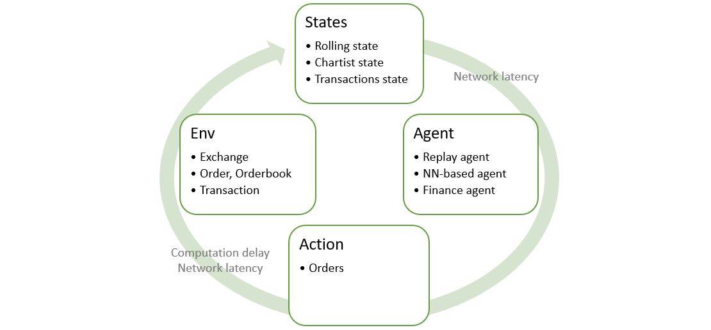
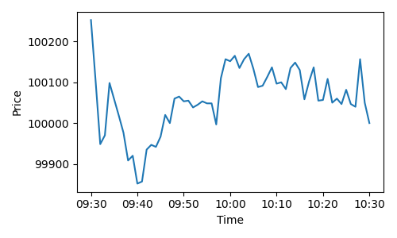

<h3 align="center">
    <br>
    <a href="https://arxiv.org/abs/2409.07486" target="_blank">📄 Paper</a> + <a href="https://mars-lmm.github.io/" target="_blank">🏠️ Project Website</a>
</h3>

<p align="center">
    
    
    
    
    
    
    
</p>


## 📢 Announcements

| **Event**                   | **Description**                                                                                              |
|-----------------------------|-------------------------------------------------------------------------------------------------------------|
| 📦 Model & Tools Release | We've released our LMM order model along with three powerful analytical tools: Stylized Facts Report, Market Forecast, and Market Impact Analysis! |
| 🎈 ICLR 2025 Acceptance | We are thrilled to announce that our paper has been accepted to ICLR 2025! |
| 🌐 Join Our Community   | Connect with us on 💬 [WeChat Group](doc/img/wechat_comm.jpg) and 👾 [Discord](https://discord.gg/jW8gKDDEqS) to share your feedback and insights! |
| 🌟 First Release      | We are excited to announce our first release! Check out the repo and enjoy your journey.                  |

## 📦 Release Overview

We are proud to release our MarS order model, available at [microsoft/mars-order-model](https://huggingface.co/microsoft/mars-order-model) in Hugging Face Hub, along with three powerful analytical tools that demonstrate the capabilities of our market simulation engine:

1. **📊 Stylized Facts Report**: Evaluates 11 key market characteristics
2. **📈 Market Forecast**: Predicts future market prices and trends
3. **💹 Market Impact Analysis**: Assesses the market impact of trading strategies

For each tool, we provide an interactive demo to help you understand its capabilities and potential applications. Please refer to our [paper](https://arxiv.org/abs/2409.07486) for detailed methodology and technical approaches.

## 🖥️ Usage & Notes

### Installation Options

#### Option 1: Using VS Code Dev Containers (Recommended)

We provide a fully configured development environment using VS Code Dev Containers:

```bash
git clone https://github.com/microsoft/MarS.git
cd MarS
```

Then, with VS Code and the Dev Containers extension installed:
1. Open the project folder in VS Code
2. **Important**: Before reopening in container, modify the `.devcontainer/devcontainer.json` file to change `"source=/data/"` to `<your/data/path>` exists on your host machine
3. When prompted, click "Reopen in Container" or use the command palette (F1) and select "Dev Containers: Reopen in Container"
4. The container will build with all dependencies and extensions configured
5. Once inside the container, install the project dependencies:
```bash
pip install -e .[dev]
```

#### Option 2: Using Docker Directly

```bash
git clone https://github.com/microsoft/MarS.git
cd MarS
docker build -t mars-env -f .devcontainer/Dockerfile .
# Modify this path to match your data directory
docker run -it --cap-add=SYS_ADMIN --device=/dev/fuse --security-opt=apparmor:unconfined --shm-size=20gb --gpus=all --privileged -v <your/data/path>:/data -v $(pwd):/workspaces/MarS -w /workspaces/MarS mars-env
# Inside the container
pip install -e .[dev]
```

> **Important**: We strongly recommend using docker to run MarS. Direct installation without Docker is not supported due to specific system dependencies and CUDA requirements.

### Download Model and Pre-requisites

We've simplified downloading all necessary components (model, converters, validation samples, and stylized facts data) using a single script:

```python
python download.py
```
> Note: The download requires sufficient disk space and may take some time depending on your internet connection.

### Starting the Order Model Ray Server

MarS uses [Ray Serve](https://docs.ray.io/en/latest/serve/index.html) to deploy the order model as a scalable, production-ready service.
To start the order model Ray server:

```bash
bash scripts/start-order-model.sh
```

> **Prerequisites:**
> - The Ray server must be running and accessible at the configured IP and port
> - Sufficient computational resources are required to run the model

To explore all of our demos in a user-friendly interface:

```bash
streamlit run market_simulation/examples/demo/home_app.py
```

The demo applications are designed to provide a quick and visual understanding of each tool's capabilities. However, there are some important considerations:

> **Using Demos vs Scripts**:
> - If you want to quickly understand what these tools can do, run the Streamlit demos for an interactive experience.
> - If you need to use these tools with your own data or in production, you'll need to modify the corresponding scripts (`report_stylized_facts.py`, `forecast.py`, `market_impact.py`) directly.

### Direct Model Interaction

If you want to interact with the model directly after starting the server, you can use the `ModelClient`.

```python
from market_simulation.rollout.model_client import ModelClient
from market_simulation.conf import C

client = ModelClient(
    model_name=C.model_serving.model_name,
    ip=C.model_serving.ip,
    port=C.model_serving.port,
)

predictions = client.get_prediction(your_input_data)
```


#### 🔧Production Deployment Prerequisites


- **Real Order-Level Data**: While our demos use noise agents to generate initial states, production-grade applications require complete order-level historical data to accurately simulate market behavior.

- **Sufficient Computational Resources**: Our research simulations typically run 128 trajectories per state to generate robust signals. In our experiments, we utilized 128 GPUs running parallel simulations across different instruments and starting states.

- **Optimized Inference Pipeline**: The current implementation prioritizes validating the model's scalability, realistic, interactive, and controllable order generation capabilities. For production deployment, significant optimizations are necessary.

#### ⚡Performance Optimization Strategies

Several strategies can substantially improve inference performance for production deployment:

- **Advanced Serving System**: Replace the current Ray-based batch inference with more optimized systems like [vLLM](https://github.com/vllm-project/vllm) to achieve higher throughput and lower latency.

- **Efficient Model Architectures**: While we currently use LLaMA for its reliability during testing, exploring more efficient architectures such as linear attention models (RetNet, RWKV), state space models (Mamba), Mixture of Experts (MoE), or Multi-head Latent Attention (MLA) could significantly improve performance.

- **Model Compression**: Implement quantization, distillation, and pruning to reduce model size and computational requirements while maintaining accuracy.

- **KV-Cache Optimization**: Our current implementation uses fixed-length sequences with sliding windows, which needs special design for KV-cache.

- **Multi-Token Prediction**: Generating multiple tokens simultaneously instead of one-by-one order generation could substantially reduce inference time.

The demos provide a user-friendly interface to experiment with different parameters and visualize results, while the scripts offer more flexibility for integration into your own workflows and data pipelines.

### 📊 Stylized Facts Report

The Stylized Facts Report evaluates 11 key market characteristics identified by [Cont (2001)](http://rama.cont.perso.math.cnrs.fr/pdf/empirical.pdf) to assess the realism of market simulations. These characteristics, known as "stylized facts," are empirical patterns consistently observed across different financial markets, instruments, and time periods.

#### Usage:

To run the stylized facts analysis:

```bash
# Ensure you've run the download.py script first to get the required data
python market_simulation/examples/report_stylized_facts.py
```

#### Stylized Facts Table:

| Fact # | Fact Name                                | Historical | Simulated |
|--------|------------------------------------------|------------|-----------|
| 1      | Absence of autocorrelations              | ×          | ×         |
| 2      | Heavy tails                              | ×          | ×         |
| 3      | Gain/loss asymmetry                      |            |           |
| 4      | Aggregational Gaussianity                | ×          | ×         |
| 5      | Intermittency                            | ×          | ×         |
| 6      | Volatility clustering                    | ×          | ×         |
| 7      | Conditional heavy tails                  | ×          | ×         |
| 8      | Slow decay of autocorrelation in absolute returns | × | × |
| 9      | Leverage effect                          |            |           |
| 10     | Volume/volatility correlation            | ×          | ×         |
| 11     | Asymmetry in timescales                  | ×          | ×         |

#### Key Results:
- 9 out of 11 stylized facts are successfully reproduced in both historical and simulated data
- The absent facts (Gain/loss asymmetry and Leverage effect) have also been noted as missing in modern US markets (Dow 30 stocks)
- The simulated data shows similar patterns to historical data across all 11 facts

#### Key Stylized Facts Examined:

1. **Absence of autocorrelations**: Linear autocorrelations of asset returns quickly decay after short time intervals
   - $\text{corr}(r(t, \Delta t), r(t+\tau, \Delta t))$

2. **Heavy tails**: Return distributions display power-law or Pareto-like tails
   - Measured through kurtosis of returns

3. **Aggregational Gaussianity**: Return distributions become more normal as the time scale increases
   - Kurtosis of returns approaches Gaussian levels at longer time scales

4. **Intermittency**: High degree of variability in returns with irregular bursts
   - Measured using Fano factor (variance-to-mean ratio) of extreme returns

5. **Volatility clustering**: Positive autocorrelation in volatility measures, showing high-volatility events tend to cluster
   - $\text{corr}(|r(t, \Delta t)|, |r(t+\tau, \Delta t)|)$

6. **Conditional heavy tails**: Return distributions still exhibit heavy tails even after accounting for volatility clustering
   - Kurtosis of normalized returns (divided by local volatility)

7. **Slow decay of absolute return autocorrelation**: Absolute returns' autocorrelation decays slowly as a power law
   - Similar to volatility clustering, measured across different lag periods

8. **Volume/volatility correlation**: Trading volume correlation with volatility measures
   - $\text{corr}(v(t, \Delta t), |r(t, \Delta t)|)$

9. **Asymmetry in timescales**: Coarse-grained volatility predicts fine-scale volatility better than the reverse
   - Correlation between coarse returns (absolute sum) and fine returns (sum of absolutes)

Our methodology rigorously tests these facts using 11,591 simulated trajectories for the top 500 liquid stocks in the Chinese market, comparing simulation outputs against historical data.

### 📈 Market Forecast

The Market Forecast tool demonstrates the predictive capabilities of the MarS model by simulating future market prices and trends through order-level simulation rather than direct price prediction.

#### Order-Level Trajectory Generation: A Paradigm Shift

Traditional forecasting approaches attempt to directly model price movements based on historical data. Our approach is fundamentally different:

1. **Order-Level Simulation**: Instead of predicting prices directly, MarS generates individual order events with their full properties (price, volume, direction)
2. **Emergent Market Behavior**: Prices and trends emerge naturally from the interactions of these simulated orders
3. **Multiple Possible Futures**: By running multiple simulations with the same starting conditions, we can explore the distribution of possible market outcomes

This approach allows us to capture the rich, complex dynamics of real markets by modeling the fundamental units of market activity - orders themselves.

#### Technical Approach:

Following [Ntakaris (2018)](https://onlinelibrary.wiley.com/doi/10.1002/for.2543), we define the price change from time $t$ to $t+k$ minute as:

$$l = \frac{\sum_{i=1}^{n} m_i / n - m_0}{m_0}$$

Where:
- $m_0$ is the mid-price at time $t$
- $n$ is the number of orders between $t$ and $t+k$ minutes
- $m_i$ is the mid-price after the $i$-th order event

#### Usage:

```bash
python market_simulation/examples/forecast.py
```

#### Forecast Tool in Demo:
<br>
*Screenshot of the Forecast tool from the interactive demo dashboard*

### 💹 Market Impact Analysis

The Market Impact Analysis tool evaluates how trading strategies affect market prices and liquidity. This tool demonstrates how the MarS engine can be used to analyze the effects of trading activities on market dynamics in a controlled environment.

#### Simulation-Based Impact Measurement: A Data-Driven Approach

Market impact analysis examines how trading activity affects asset prices - one of the most important "What If" questions in finance. Traditional approaches rely on:
- Strong theoretical assumptions
- Simplified empirical formulas (like Square-Root-Law)
- Costly and risky live trading experiments

Our simulation-based approach offers significant advantages:

1. **Controlled Experimentation**: Test trading strategies without real-world risk
2. **Counterfactual Analysis**: Directly compare market behavior with and without a trading strategy
3. **Parameter Exploration**: Test different execution parameters systematically
4. **Realistic Market Reactions**: Capture how other market participants dynamically respond to your trading strategy

#### Technical Implementation

As implemented in `market_impact.py`, our approach:

1. **Establishes a baseline**: First runs simulations without the trading strategy to establish normal market behavior
   ```python
   tasks = [RolloutTask(..., include_twap_agent=False, ...)]
   ```

2. **Measures market volume**: Calculates average trading volume during the simulation period
   ```python
   avg_volume = get_avg_volume(results, init_end_time, end_time)
   target_volume = int(avg_volume * volume_ratio) // 100 * 100
   ```

3. **Introduces a trading strategy**: Adds a TWAP (Time-Weighted Average Price) agent with configurable parameters
   ```python
   trading_tasks = [RolloutTask(..., include_twap_agent=True, twap_agent_target_volume=target_volume, ...)]
   ```

4. **Analyzes the impact**: Compares price trajectories, execution quality, and market liquidity between baseline and strategy simulations

The simulation process involves two distinct phases:
- **Initialization Phase**: Establishing realistic starting market conditions
- **Impact Analysis Phase**: Measuring how the TWAP strategy affects market dynamics

#### Usage:

```bash
python market_simulation/examples/market_impact.py
```
#### Impact Analysis Tool in Demo:
<br>
*Screenshot of the Market Impact Analysis tool from the interactive demo dashboard*


## 📖 Introduction
<h3 align="left">
    MarS: A Financial Market Simulation Engine Powered by Generative Foundation Model
</h3>
<br>

MarS is a cutting-edge financial market simulation engine powered by the Large Market Model (LMM), a generative foundation model. MarS addresses the need for realistic, interactive, and controllable order generation. This paper's primary goals are to evaluate the LMM's scaling law in financial markets, assess MarS's realism, balance controlled generation with market impact, and demonstrate MarS's potential applications.

Below is a high-level overview diagram illustrating the core components, workflow, and potential applications of the MarS simulation engine:



### 🎯 Main Contributions
- We take the first step toward building a generative foundation model as a world model for financial market and verify the scaling law of the Large Market Model. It demonstrates the huge potential of this new direction of domain-specific foundation models.
- We design a realistic Market Simulation based on the LMM to fulfill two key requirements: generating target scenarios and modeling order market impacts, thereby unlocking LMM's potential for meaningful applications.
- We showcase four types of downstream applications of MarS, demonstrating the significant potential of the MarS-based paradigm for the industry.

For more detailed information, please refer to our [paper](https://arxiv.org/abs/2409.07486) and [website](https://mars-lmm.github.io/).

## 🚀 Current Release

We are excited to release the MarS simulation engine along with examples demonstrating its capabilities for market simulation. This release includes:
- [mlib](mlib): The core engine for generating and simulating financial market orders.
- [market_simulation](market_simulation): Example scripts illustrating how to use the MarS engine for market simulations.

The release of the pretrained model is currently undergoing internal review. We will make the model public once it passes the review. We look forward to sharing more features, examples, and applications in the future. Stay tuned for updates!


## 📊 Market Simulatin Library

**🛠️ mlib** is a comprehensive library dedicated to market simulation, designed to be user-friendly, allowing users to focus on the design of states and agents.

Behind the scenes, we automatically:

- Refresh the orderbook with incoming orders.
- Update states with pertinent trade information.
- Distribute states and actions considering network and computational latency.

### 🗂️ Overall architecture



#### 🌍 Env

Env is a [gym](https://www.gymlibrary.dev/)-like interface. Below is an example of how to generate orders using env and a noise agent:

```python
agent = NoiseAgent(
    symbol=symbol,
    init_price=100000,
    interval_seconds=1,
    start_time=start_time,
    end_time=end_time,
)
env = Env(exchange, description="Noise agent simulation")
env.register_agent(agent)
env.push_events(create_exchange_events(config))
for observation in env.env():
    action = observation.agent.get_action(observation)
    env.step(action)
```

#### 🔄 States

States are information available to agents, automatically updated with every trade information, including orders, transactions, and orderbook snapshots as defined in [trade_info.py](mlib/core/trade_info.py).

States are shared by agents and zero-copy during their lifetime, even in environments supporting delayed states.

- Creating a new state is straightforward. Here is an example of creating one that includes all transactions:

```python

class TransState(State):
    def __init__(self) -> None:
        super().__init__()
        self.transactons: List[Transaction] = []

    def on_trading(self, trade_info: TradeInfo):
        super().on_trading(trade_info)
        self.transactons.extend(trade_info.transactions)

    def on_open(self, cancel_transactions: List[Transaction], lob_snapshot: LobSnapshot, match_trans: Optional[Transaction] = None):
        super().on_open(cancel_transactions=cancel_transactions, lob_snapshot=lob_snapshot, match_trans=match_trans)
        self.transactons.extend(cancel_transactions)
        if match_trans:
            self.transactons.append(match_trans)

    def on_close(self, close_orderbook: Orderbook, lob_snapshot: LobSnapshot, match_trans: Optional[Transaction] = None):
        super().on_close(match_trans=match_trans, close_orderbook=close_orderbook, lob_snapshot=lob_snapshot)
        if match_trans:
            self.transactons.append(match_trans)
```

Once a new state is defined and registered with `exchange.register_state(state)`, it will be available when the agent wakes up.

So far, we have defined the following states:

- [trans_state](market_simulation/states/trans_state.py) contains all transactions.
- [trade_info_state](market_simulation/states/trade_info_state.py) contains all trade information.

#### 🕹️ Example: Run Simulation with Noise Agent

You can run the [run_simulaton.py](market_simulation/examples/run_simulation.py) for a complete example to perform market simulation with a noise agent.

```python
python market_simulation/examples/run_simulation.py
```

You can see the price trajectory generated from matching orders by the noise agent as follow:



Note: This example demonstrates the use of MarS to simulate a market with a noise agent. For realistic market simulations, a more comprehensive model, such as the Large Market Model (LMM) in MarS, is typically required.


## ⚠️ Disclaimer

Users of the market simulation engine and the code should prepare their own agents which may be included trained models built with users' own data, independently assess and test the risks of the model in a specify use scenario, ensure the responsible use of AI technology, including but limited to developing and integrating risk mitigation measures, and comply with all applicable laws and regulations. The market simulation engine does not provide financial opinions, nor is it designed to replace the role of qualified financial professionals in formulating, assessing, and approving finance products. The outputs of the market simulation engine do not reflect the opinions of Microsoft.

## 🤝 Contributing

This project welcomes contributions and suggestions.  Most contributions require you to agree to a
Contributor License Agreement (CLA) declaring that you have the right to, and actually do, grant us
the rights to use your contribution. For details, visit https://cla.opensource.microsoft.com.

When you submit a pull request, a CLA bot will automatically determine whether you need to provide
a CLA and decorate the PR appropriately (e.g., status check, comment). Simply follow the instructions
provided by the bot. You will only need to do this once across all repos using our CLA.

This project has adopted the [Microsoft Open Source Code of Conduct](https://opensource.microsoft.com/codeofconduct/).
For more information see the [Code of Conduct FAQ](https://opensource.microsoft.com/codeofconduct/faq/) or
contact [opencode@microsoft.com](mailto:opencode@microsoft.com) with any additional questions or comments.

## ™️ Trademarks

This project may contain trademarks or logos for projects, products, or services. Authorized use of Microsoft
trademarks or logos is subject to and must follow
[Microsoft's Trademark & Brand Guidelines](https://www.microsoft.com/en-us/legal/intellectualproperty/trademarks/usage/general).
Use of Microsoft trademarks or logos in modified versions of this project must not cause confusion or imply Microsoft sponsorship.
Any use of third-party trademarks or logos are subject to those third-party's policies.

## 📑 Citations

```bibtex
@article{li2024mars,
  title={MarS: a Financial Market Simulation Engine Powered by Generative Foundation Model},
  author={Li, Junjie and Liu, Yang and Liu, Weiqing and Fang, Shikai and Wang, Lewen and Xu, Chang and Bian, Jiang},
  journal={arXiv preprint arXiv:2409.07486},
  year={2024}
}
```
